# Итоговое задание — DataOps

Полный цикл сборки и развёртывания ML-сервиса: от поднятия ключевых компонентов
(MLflow, Airflow, LakeFS, JupyterHub) и регистрации артефактов до подготовки
сервиса к деплою в Kubernetes с использованием Helm Charts.

## Структура проекта

```
.
├── stage1-mlflow/           # MLflow Tracking Server
│   ├── Dockerfile
│   ├── docker-compose.yaml
│   ├── .env
│   └── research/
│       └── train_model.py   # Обучение моделей с логированием в MLflow
├── stage2-airflow/          # Apache Airflow
│   ├── docker-compose.yaml
│   ├── .env
│   └── dags/
│       ├── etl_pipeline_dag.py
│       ├── ml_training_dag.py
│       └── ml_service_health_dag.py
├── stage3-lakefs/           # LakeFS — версионирование данных
│   ├── Dockerfile
│   ├── docker-compose.yaml
│   └── .env
├── stage4-jupyterhub/       # JupyterHub
│   ├── Dockerfile
│   ├── docker-compose.yaml
│   ├── jupyterhub_config.py
│   └── .env
├── stage5-ml-service/       # ML-сервис (FastAPI)
│   ├── Dockerfile
│   ├── docker-compose.yaml
│   ├── requirements.txt
│   ├── .env
│   └── mlapp/
│       ├── server.py        # FastAPI приложение
│       ├── __main__.py
│       └── model/model.pkl  # Обученная модель
├── stage6-monitoring/       # Prometheus + Grafana
│   ├── docker-compose.yaml
│   ├── .env
│   └── configs/
│       ├── prometheus.yml
│       └── grafana/         # Авто-провизионинг дашбордов
├── stage7-kubernetes/       # Kubernetes-манифесты
│   ├── deployment.yaml
│   ├── service.yaml
│   ├── ingress.yaml
│   ├── configmap.yaml
│   └── hpa.yaml
├── stage8-helm/             # Helm chart
│   └── ml-service-chart/
│       ├── Chart.yaml
│       ├── values.yaml
│       ├── templates/
│       └── examples/        # Production и Staging конфигурации
├── stage9-prompts/          # MLflow Prompt Storage
│   └── register_prompts.py
├── scripts/
│   └── smoke_test.sh        # Smoke-тест эндпоинтов
└── Makefile                 # Управление всеми сервисами
```

## Быстрый старт

Все сервисы можно запустить одновременно одной командой:

```bash
make all.up          # Запуск всех сервисов
make status          # Проверка статуса контейнеров
make all.down        # Остановка всех сервисов
```

Каждый этап также можно запускать по отдельности (см. ниже).

## Этап 1. MLflow

Развёрнут MLflow Tracking Server для отслеживания экспериментов и хранения артефактов.
Стек состоит из трёх компонентов: PostgreSQL 17 для хранения метаданных,
MinIO в качестве S3-совместимого хранилища артефактов и непосредственно MLflow Server.

В рамках демонстрации запущен скрипт обучения моделей (`research/train_model.py`),
который тренирует несколько моделей на датасете диабета из sklearn и логирует
параметры, метрики и артефакты в MLflow.

**Файлы:** [`Dockerfile`](stage1-mlflow/Dockerfile), [`docker-compose.yaml`](stage1-mlflow/docker-compose.yaml), [`.env`](stage1-mlflow/.env), [`train_model.py`](stage1-mlflow/research/train_model.py)

```bash
make mlflow.up       # Запуск: http://localhost:5001
make mlflow.train    # Обучение моделей
```

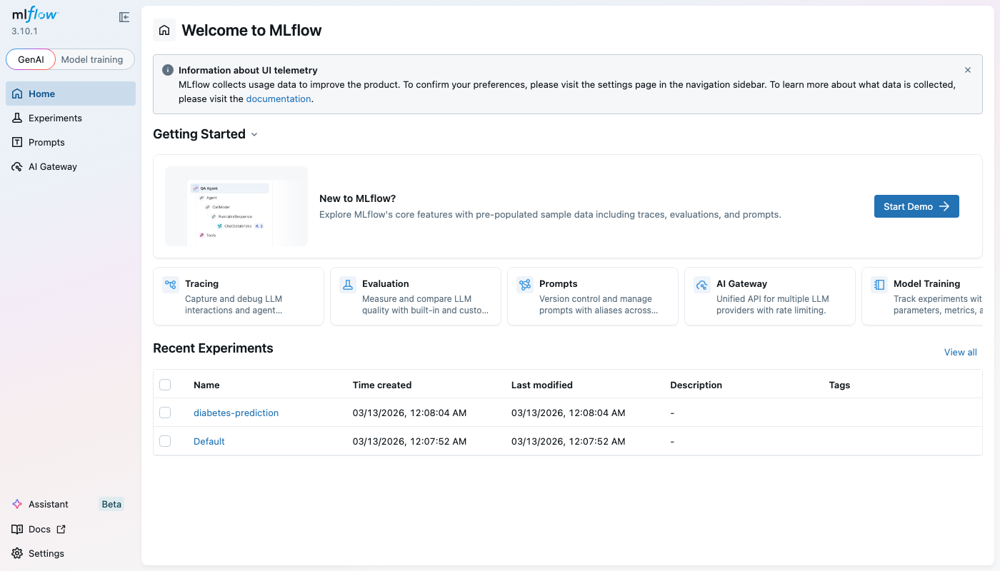

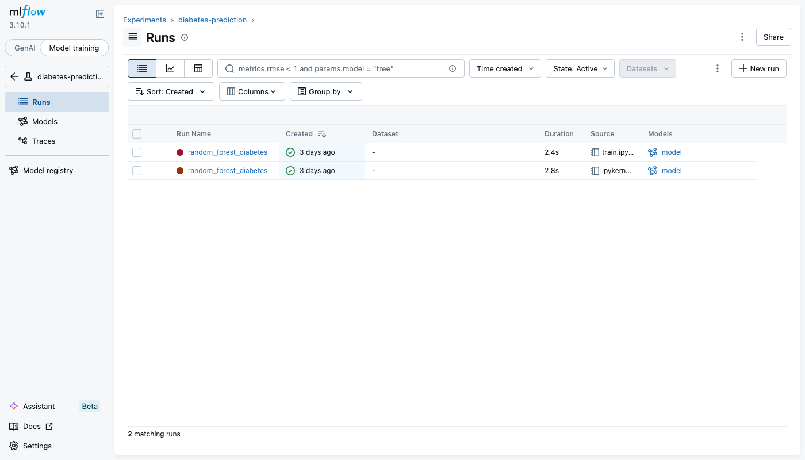

## Этап 2. Airflow

Развёрнут Apache Airflow 2.10.5 с LocalExecutor для оркестрации пайплайнов.
Реализованы три DAG-а, покрывающие типовые сценарии ML-проекта:

- **etl_pipeline** — цепочка extract → transform → validate → load
- **ml_training_pipeline** — подготовка данных → обучение → оценка → регистрация модели
- **ml_service_health_check** — почасовая проверка здоровья ML-сервиса

**Файлы:** [`docker-compose.yaml`](stage2-airflow/docker-compose.yaml), [`.env`](stage2-airflow/.env), [`etl_pipeline_dag.py`](stage2-airflow/dags/etl_pipeline_dag.py), [`ml_training_dag.py`](stage2-airflow/dags/ml_training_dag.py), [`ml_service_health_dag.py`](stage2-airflow/dags/ml_service_health_dag.py)

```bash
make airflow.up      # Запуск: http://localhost:8080
```

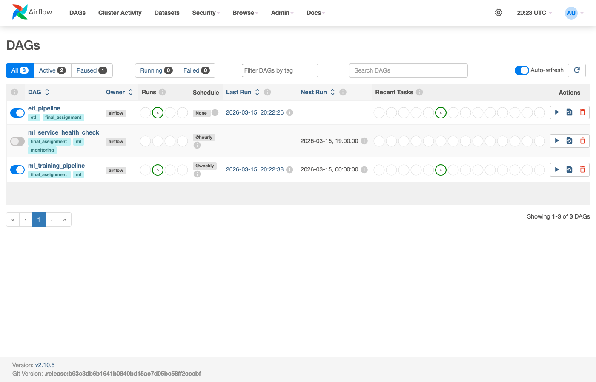

## Этап 3. LakeFS

Развёрнут LakeFS — система версионирования данных, работающая по принципу Git.
Стек включает PostgreSQL 15 для метаданных и MinIO в качестве blockstore.

Продемонстрирован полный рабочий процесс: создание репозитория `ml-data`,
создание ветки `add-training-data`, загрузка CSV-файла с данными
и фиксация изменений через commit.

**Файлы:** [`Dockerfile`](stage3-lakefs/Dockerfile), [`docker-compose.yaml`](stage3-lakefs/docker-compose.yaml), [`.env`](stage3-lakefs/.env)

```bash
make lakefs.up       # Запуск: http://localhost:8001
```

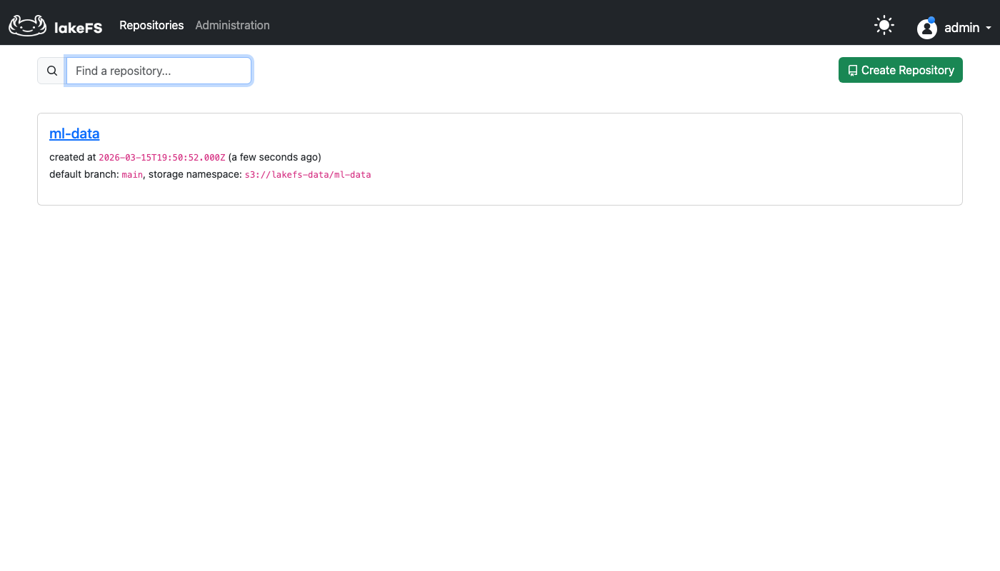

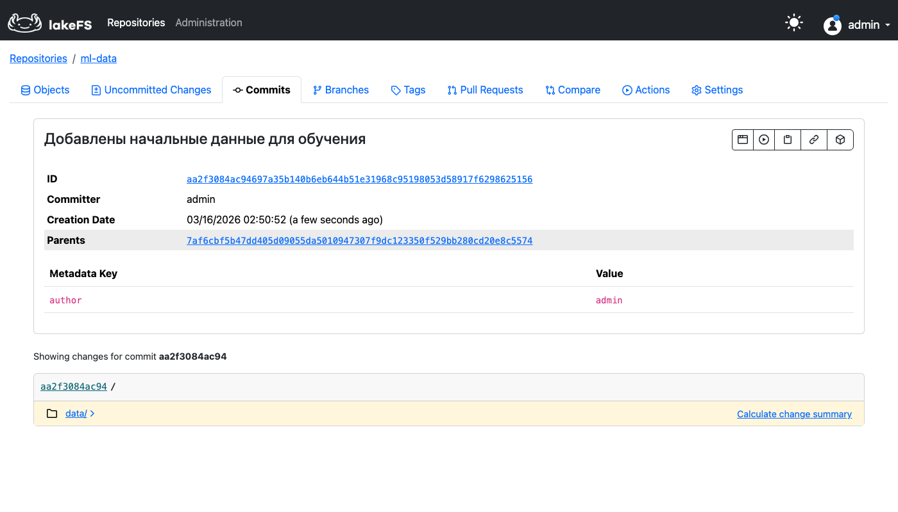

## Этап 4. JupyterHub

Развёрнут JupyterHub с JupyterLab в качестве среды разработки.
Базовый образ собран на основе python:3.14-slim с установленными
jupyterhub, jupyterlab и notebook.

**Файлы:** [`Dockerfile`](stage4-jupyterhub/Dockerfile), [`docker-compose.yaml`](stage4-jupyterhub/docker-compose.yaml), [`.env`](stage4-jupyterhub/.env), [`jupyterhub_config.py`](stage4-jupyterhub/jupyterhub_config.py)

```bash
make jupyterhub.up   # Запуск: http://localhost:8888
```

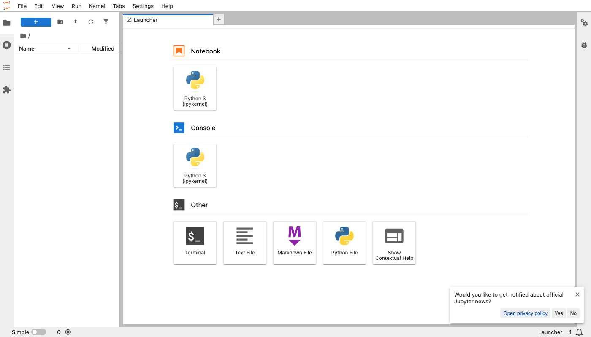

## Этап 5. ML-сервис

Реализован ML-сервис предсказания прогрессии диабета на основе FastAPI.
Модель обучена на стандартном датасете из sklearn и сериализована в `model.pkl`.

Эндпоинты:
- `GET /health` — проверка здоровья и статуса загрузки модели
- `POST /api/v1/predict` — предсказание по 10 медицинским признакам пациента
- `GET /metrics` — Prometheus-метрики

Реализовано JSON-структурированное логирование, запись предсказаний
в PostgreSQL (вход, выход, время, версия модели) и экспорт метрик
через `starlette-exporter`. В Dockerfile добавлен healthcheck через curl.

**Файлы:** [`Dockerfile`](stage5-ml-service/Dockerfile), [`docker-compose.yaml`](stage5-ml-service/docker-compose.yaml), [`.env`](stage5-ml-service/.env), [`server.py`](stage5-ml-service/mlapp/server.py), [`requirements.txt`](stage5-ml-service/requirements.txt)

```bash
make mlapp.up        # Запуск: http://localhost:8000
make mlapp.test      # Тестирование эндпоинтов
```

Результат запросов к сервису:

```
$ curl -s http://localhost:8000/health
{"status":"ok","model_loaded":true,"version":"1.0.0"}

$ curl -s -X POST http://localhost:8000/api/v1/predict \
  -H "Content-Type: application/json" \
  -d '{"age":0.05,"sex":0.05,"bmi":0.06,"bp":0.02,"s1":-0.04,"s2":-0.03,"s3":-0.04,"s4":0.03,"s5":0.04,"s6":-0.01}'
{"predict":99.51,"model_version":"1.0.0"}
```

Логи сервиса:

```
INFO:     Started server process [1]
INFO:     Waiting for application startup.
{"asctime": "2026-03-17T03:23:57", "name": "mlapp", "levelname": "INFO", "message": "Модель загружена", "taskName": "Task-2", "path": "/app/mlapp/model/model.pkl"}
INFO:     Application startup complete.
INFO:     Uvicorn running on http://0.0.0.0:8000 (Press CTRL+C to quit)
{"asctime": "2026-03-17T03:24:10", "name": "mlapp", "levelname": "INFO", "message": "Предсказание", "taskName": null, "prediction": 99.51, "model_version": "1.0.0", "duration_ms": 4.79}
INFO:     151.101.128.223:43273 - "POST /api/v1/predict HTTP/1.1" 200 OK
```

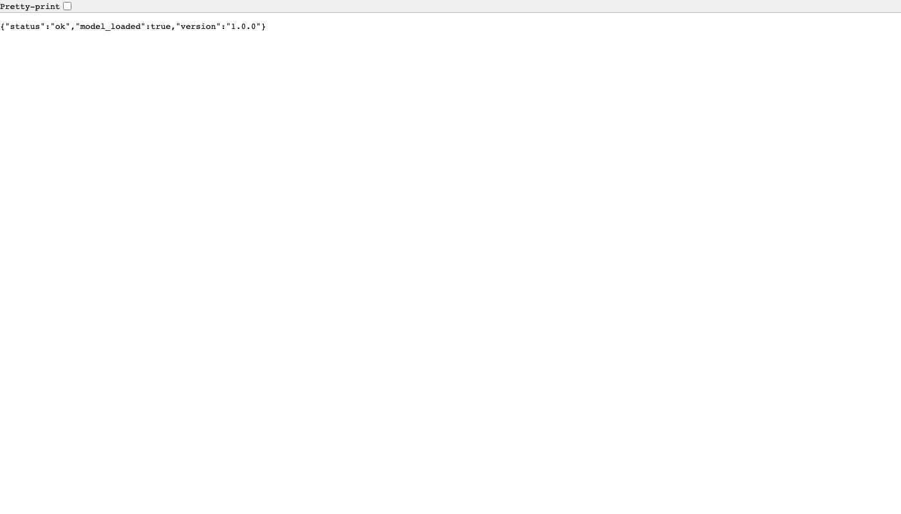

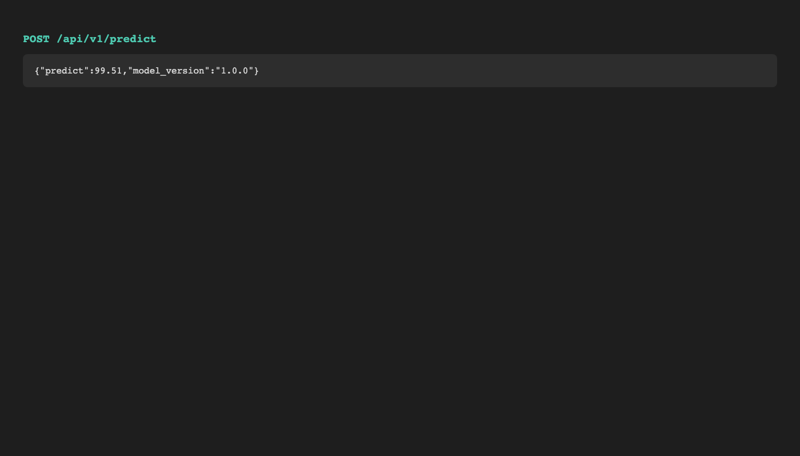

## Этап 6. Мониторинг

Собран единый стек мониторинга: ML-сервис + Prometheus + Grafana + node-exporter.

Prometheus собирает метрики с трёх целей: собственные метрики, node-exporter
для системных метрик хоста и ML-сервис для метрик приложения.

Grafana-дашборд автоматически провизионируется при запуске и содержит:

**Обзор сервиса** — статус (UP/DOWN), общее число запросов, средняя латентность,
количество 5xx-ошибок, текущий RPS.

**Запросы и латентность** — request rate по эндпоинтам, перцентили латентности
(p50/p95/p99), распределение по кодам ответа, длительность по эндпоинтам.

**Системные метрики** — использование CPU и памяти (графики и gauge),
сетевой трафик по интерфейсам.

**Файлы:** [`docker-compose.yaml`](stage6-monitoring/docker-compose.yaml), [`.env`](stage6-monitoring/.env), [`prometheus.yml`](stage6-monitoring/configs/prometheus.yml), [`ml-service.json`](stage6-monitoring/configs/grafana/dashboards/ml-service.json)

```bash
make monitoring.up   # Grafana: http://localhost:3000, Prometheus: http://localhost:9090
```

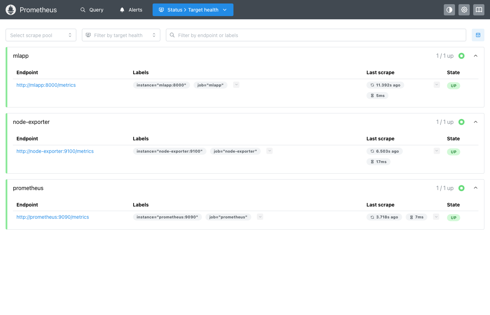

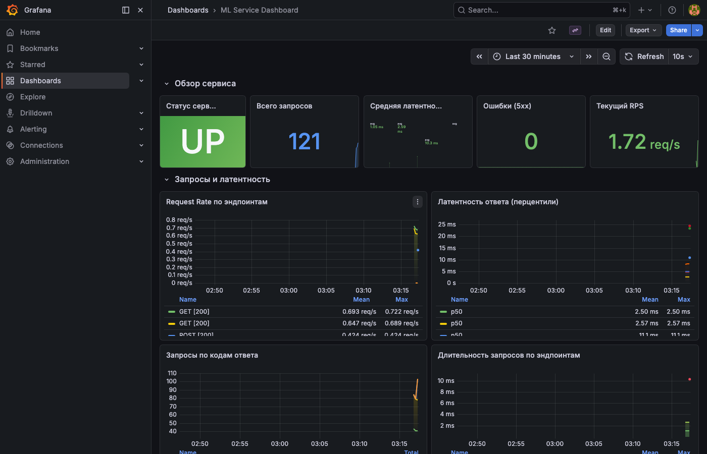

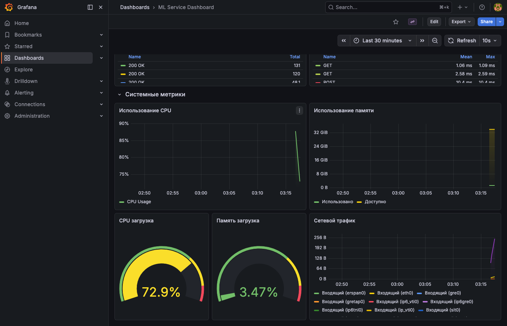

## Этап 7. Kubernetes-манифесты

Подготовлены манифесты для развёртывания ML-сервиса в Kubernetes:

- **deployment.yaml** — 2 реплики, startup/readiness/liveness probes
- **service.yaml** — ClusterIP на порту 80
- **ingress.yaml** — HTTP-доступ через nginx-ingress
- **configmap.yaml** — конфигурация (MODEL_VERSION, LOG_LEVEL)
- **hpa.yaml** — автоскейлинг 2–8 подов по CPU и памяти

**Файлы:** [`deployment.yaml`](stage7-kubernetes/deployment.yaml), [`service.yaml`](stage7-kubernetes/service.yaml), [`ingress.yaml`](stage7-kubernetes/ingress.yaml), [`configmap.yaml`](stage7-kubernetes/configmap.yaml), [`hpa.yaml`](stage7-kubernetes/hpa.yaml)

```bash
kubectl apply -f stage7-kubernetes/
```

## Этап 8. Helm Chart

Создан Helm chart для ML-сервиса с полной параметризацией.
Настраиваемые параметры: образ (repository, tag), ресурсы (CPU, memory),
количество реплик, probes, ingress, автоскейлинг (HPA).

Подготовлены примеры конфигураций для production и staging окружений
в директории `examples/`.

**Файлы:** [`Chart.yaml`](stage8-helm/ml-service-chart/Chart.yaml), [`values.yaml`](stage8-helm/ml-service-chart/values.yaml), [`templates/`](stage8-helm/ml-service-chart/templates/), [`values-production.yaml`](stage8-helm/ml-service-chart/examples/values-production.yaml), [`values-staging.yaml`](stage8-helm/ml-service-chart/examples/values-staging.yaml)

```bash
helm install ml-release stage8-helm/ml-service-chart/

# Production-конфигурация
helm install ml-prod stage8-helm/ml-service-chart/ \
  -f stage8-helm/ml-service-chart/examples/values-production.yaml
```

## Этап 9. Prompt Storage

Реализована регистрация версий промптов в MLflow Prompt Storage.
Зарегистрированы 3 промпта, каждый в двух версиях:

- **patient_analysis** — анализ медицинских данных пациента (v1 — базовая, v2 — расширенная)
- **prediction_explanation** — интерпретация предсказания модели (v1 — простая, v2 — структурированная)
- **model_report** — генерация отчёта о производительности модели (v1 — краткий, v2 — для заинтересованных лиц)

**Файлы:** [`register_prompts.py`](stage9-prompts/register_prompts.py)

```bash
make mlflow.up
make prompts.register
```

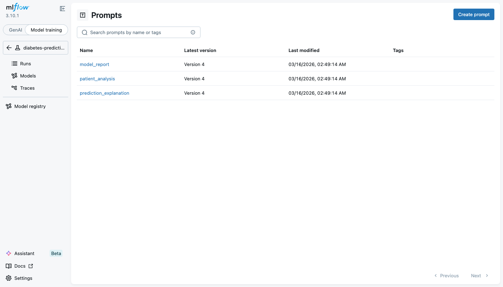

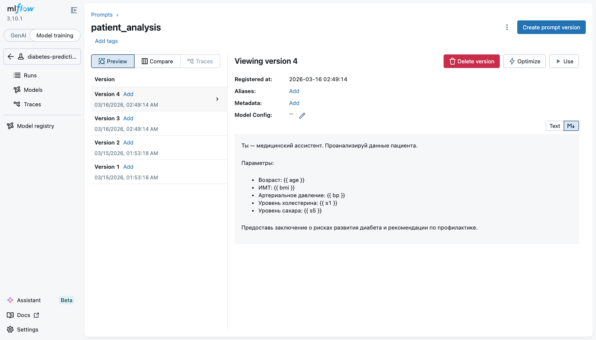

## Порты сервисов

Все порты разведены — сервисы можно запускать одновременно без конфликтов.

| Сервис | Порт | Этап |
|--------|------|------|
| MLflow | 5001 | 1 |
| MinIO S3 (MLflow) | 9004 | 1 |
| MinIO Console (MLflow) | 9005 | 1 |
| Airflow | 8080 | 2 |
| LakeFS | 8001 | 3 |
| MinIO Console (LakeFS) | 9003 | 3 |
| JupyterHub | 8888 | 4 |
| ML-сервис | 8000 | 5, 6 |
| Prometheus | 9090 | 6 |
| Grafana | 3000 | 6 |
